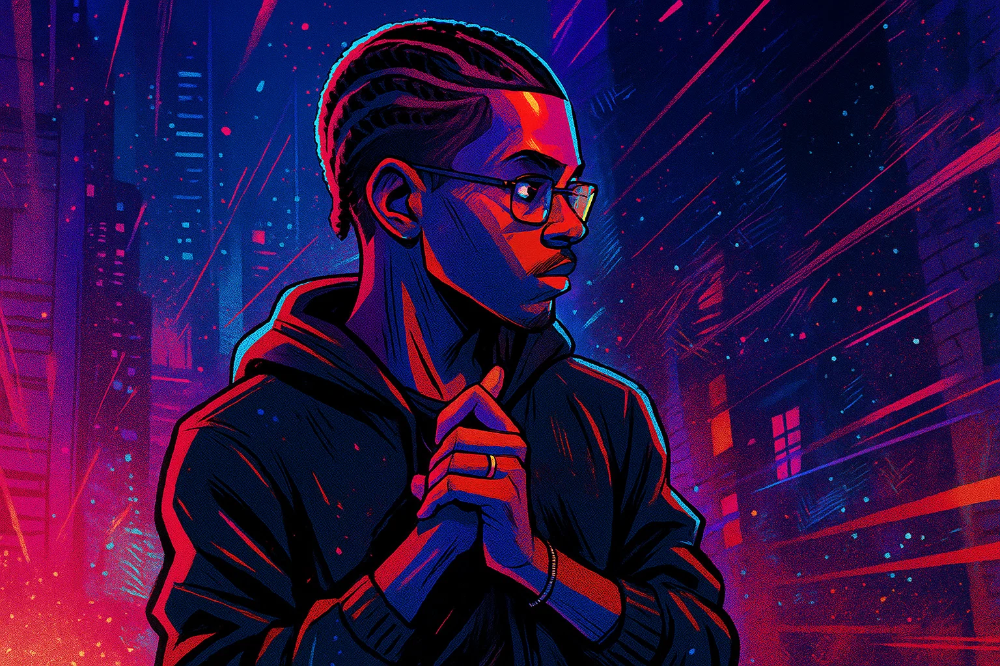
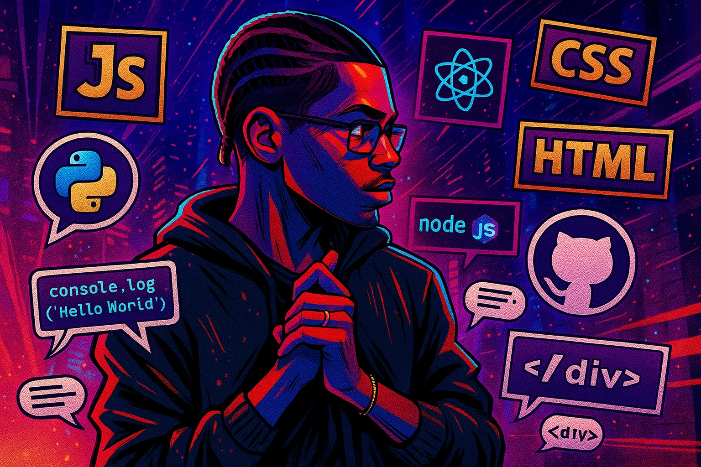

  
 

  
  

 

<table>
  <tr>
    <td>
      
    </td>
    <td>
      <h3>Sobre mim</h3>
      

        Fala, eu sou o <strong>ARM8745</strong>! 
        Programador Full-Stack, nerd de alma, e apaixonado por tudo que envolve tecnologia e cultura pop. 
        Curto criar soluções criativas no código e na vida, sempre com aquele olhar geek e um sorriso pronto para compartilhar conhecimento. 
        HQs, mangás, games e séries: tudo isso faz parte do meu combustível diário. 
        Aqui você vai encontrar projetos, tutoriais e muita troca bacana. Bora conversar, colaborar e evoluir juntos!
      

    </td>
  </tr>
</table>

Dev por paixão, geek por opção!  
Sempre pronto para um papo sobre tecnologia, cultura nerd e boas histórias.

### 
Cada commit aqui é um power up! 🚀 Explore ideias, projetos e códigos em constante evolução. 👾✨

---

### 🔭 **O que rola por aqui:**  
- **Projetos autorais**: de front a back, sempre com criatividade e boas práticas.
- **Tutoriais & Dicas**: conteúdo direto ao ponto para todo mundo crescer junto.
- **Referências nerds**: cultura pop, HQs, mangás, animes e jogos sempre presentes!

💡 **Sinta-se em casa para explorar, contribuir ou só bater um papo geek!**

---

## 🚀 Tech Stack 

  
  
  
  
  
  

---

### 🌐 **Conecte-se comigo**  

  
  
  

---

<!--  
Se quiser deixar ainda mais com a sua cara, me fala suas redes e uma frase ou referência que te represente!
-->
